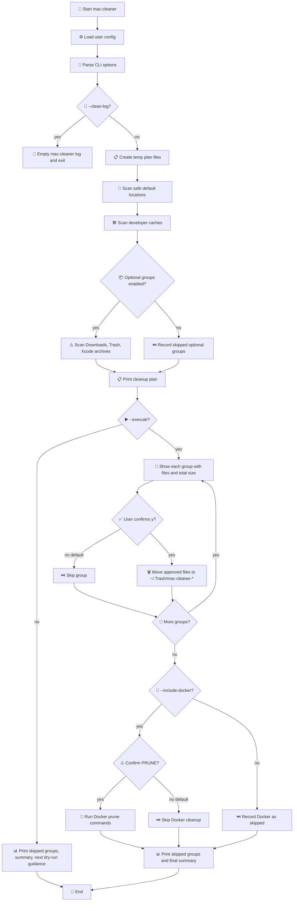

# Mac-Cleaner Shell Script: Safe, Interactive macOS Cleanup


`mac-cleaner` is a conservative macOS cleanup script inspired by common CleanMyMac-style maintenance tasks. It focuses on cache, log, temporary, developer, Trash, Downloads, and optional Docker cleanup, with dry-run first and recoverable moves to Trash.

The script defaults to dry-run mode. It scans first, builds a sorted cleanup plan, estimates risk by cleanup group, and prints what can be cleaned before moving anything. Execute mode shows each cleanup group with file names and total size, then asks `y/N` before moving files to a recovery folder in `~/.Trash`. The default answer is No.

## Quick Start

Install the command somewhere on your `PATH`:

```bash
make install PREFIX="$HOME/.local"
```

Optionally start from the example config:

```bash
mkdir -p ~/.config/mac-cleaner
cp examples/mac-cleaner.config.example ~/.config/mac-cleaner/config
```

Always begin with a dry run. This scans and prints the cleanup plan without moving anything:

```bash
mac-cleaner --verbose
```

Read the output carefully. Check cleanup groups, total sizes, and any paths that look personal, project-specific, or surprising. For a full file-by-file review, run:

```bash
mac-cleaner --show-files
```

Only after the dry-run output looks safe, run interactive execute mode:

```bash
mac-cleaner --execute
```

Execute mode shows each group again, asks `y/N`, and defaults to No. Approved files are moved into a timestamped recovery folder under `~/.Trash`, not permanently deleted.

Be careful and vigilant with cleanup tools. Do not approve a group just because it is listed; approve it only when you understand what will be moved.

## Repository Layout

```text
.
├── mac-cleaner.sh
├── Makefile
├── README.md
├── examples/
│   └── mac-cleaner.config.example
└── .gitignore
```

- `mac-cleaner.sh`: the cleanup script and command-line interface.
- `Makefile`: install, uninstall, and check targets.
- `examples/mac-cleaner.config.example`: a safe starter config to copy into your user config directory.
- Runtime logs are not stored in the repository. They live at `${XDG_STATE_HOME:-$HOME/.local/state}/mac-cleaner/mac-cleaner.log`.
- Recovery folders are created under `~/.Trash/mac-cleaner-*` during execute mode.

## Configuration

You can persist your favorite options in `~/.config/mac-cleaner/config`. A legacy `~/.mac-cleaner.rc` file is also supported.

Start from the example config:

```bash
mkdir -p ~/.config/mac-cleaner
cp examples/mac-cleaner.config.example ~/.config/mac-cleaner/config
```

Example `~/.config/mac-cleaner/config`:

```bash
OLDER_THAN_DAYS=30
VERBOSE=1
SHOW_FILES=0

INCLUDE_DOWNLOADS=0
INCLUDE_DOCKER=0
INCLUDE_XCODE_ARCHIVES=0
EMPTY_TRASH=0
```

The config file is loaded as a shell fragment, so only use values you trust.

## Logging

The script maintains a persistent log of its actions at `${XDG_STATE_HOME:-$HOME/.local/state}/mac-cleaner/mac-cleaner.log`.

The persistent log is privacy-aware: exact local paths are shown in terminal output for review, but path details are omitted from the saved log. The log directory is created with owner-only permissions when possible.

To empty the log without running a cleanup scan:

```bash
mac-cleaner --clean-log
```

## Installation

A `Makefile` is provided for easy installation and removal:

- `make install`: Installs the script to `/usr/local/bin/mac-cleaner` (default). You can change the path with `PREFIX`, e.g., `make install PREFIX=$HOME/.local`.
- `make uninstall`: Removes the script.
- `make check`: Runs syntax checks and ShellCheck when available.

## Useful Options

```bash
mac-cleaner --dry-run --older-than 30 --include-downloads --verbose
mac-cleaner --show-files
mac-cleaner --clean-log
mac-cleaner --execute --empty-trash
mac-cleaner --execute --include-docker
mac-cleaner --execute --include-xcode-archives
```

## What It Cleans

- Old user cache contents, including common browser and editor caches.
- Old files in `~/Library/Logs`.
- Old crash reports.
- Old temporary files from the current macOS temp directory.
- Developer caches such as Xcode DerivedData, Homebrew, npm, pip, Cargo, Gradle, and simulator caches.
- Optional old files in `~/Downloads`.
- Optional `~/.Trash` contents.
- Optional Docker builder and system prune.
- Optional old Xcode Organizer archives.

## Review Workflow

1. Run dry-run mode first: `mac-cleaner --verbose`.
2. Use `mac-cleaner --show-files` when you need to inspect every matched path.
3. Check item counts, estimated sizes, risk labels, and file names before executing.
4. Re-run with `--execute` only after the cleanup plan looks safe.
5. In execute mode, review each group's file list and total size.
6. Answer `y` only for groups you understand. Pressing Enter skips the group.
7. Review the recovery folder in `~/.Trash/mac-cleaner-*` before emptying Trash.

## Logic Flow



## Safety Notes

- The script does not scan protected system folders.
- It does not require administrator privileges.
- `~/Downloads`, `~/.Trash`, Docker cleanup, and Xcode Organizer archives are opt-in.
- Execute mode moves files to `~/.Trash/mac-cleaner-*` first instead of permanently deleting them.
- Interactive execute mode requires typing `y` before each group is moved; the default is No.
- `--yes` can skip low/medium-risk prompts in trusted automation. High-risk groups still ask.
- Docker cleanup is separate and permanent. In interactive execute mode, it requires typing `PRUNE`.
- Be extra careful with `--include-downloads`, `--empty-trash`, `--include-docker`, and `--include-xcode-archives`.
- Xcode Organizer archives can contain release builds, dSYMs, and submission history. Review dry-run output before including them.
- Always run a dry run first and read the output before using `--execute`.

## License

MIT License. See [LICENSE](LICENSE).
