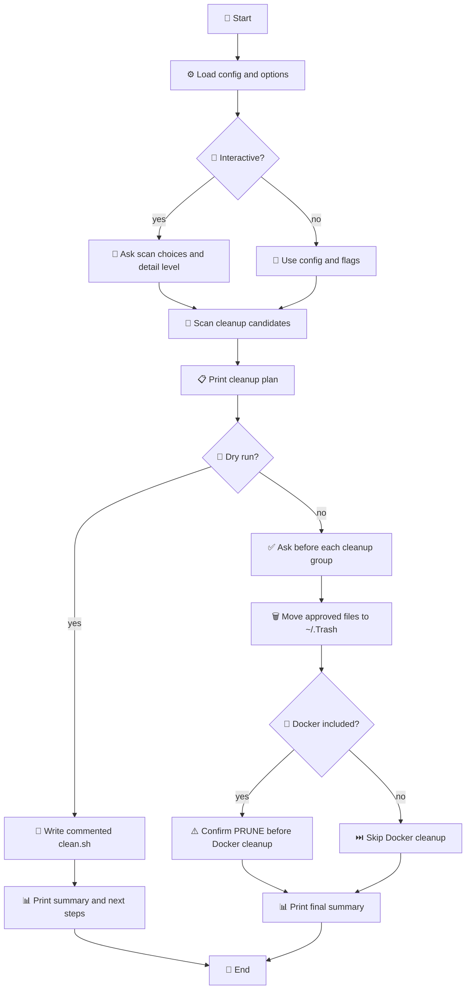

# mac-cleaner: Safe, Review-First macOS Cleanup


`mac-cleaner` is a conservative macOS cleanup script inspired by common CleanMyMac-style maintenance tasks. It focuses on old caches, logs, temporary files, developer caches, and opt-in cleanup areas such as Downloads, Trash, Docker, and Xcode archives.

The default is safe: it scans only, prints a review plan, and writes a commented cleanup script. Execute mode never permanently deletes files; approved items are moved into a timestamped recovery folder under `~/.Trash`.

**Keywords**: macOS cleanup, cache cleaner, log cleanup, dry run, interactive shell script, safe delete, Trash recovery, developer caches, Docker prune, Xcode cleanup.

## Quick Start

Install the command somewhere on your `PATH`:

```bash
make install PREFIX="$HOME/.local"
```

Optionally start from the example config:

```bash
mkdir -p ~/.config/mac-cleaner
cp examples/mac-cleaner.config.example ~/.config/mac-cleaner/config
```

Always start with a dry run:

```bash
mac-cleaner --verbose
```

Dry-run mode does three things:

- Prints a cleanup plan grouped by risk and category.
- Shows how many items and how much space could be cleaned.
- Writes `./clean.sh` with commented `rm -rf` lines for manual review.

If `clean.sh` already exists, the script writes a timestamped `clean-*.sh` file instead. Nothing in the generated file runs until you edit it yourself.

For a full file-by-file review:

```bash
mac-cleaner --show-files
```

For a guided flow:

```bash
mac-cleaner --interactive
```

Interactive mode asks which optional areas to scan, how much detail to show, and whether to continue into execute mode after review.

When the plan looks safe:

```bash
mac-cleaner --execute
```

Execute mode shows each group again, asks `y/N/q`, and defaults to No. Approved files are moved to `~/.Trash/mac-cleaner-*`, not permanently deleted. Type `q` to stop reviewing the remaining groups.

Be careful and vigilant with cleanup tools. Do not approve a group just because it is listed; approve it only when you understand what will be moved.

## Output Summary

Every run ends with a summary like this:

```text
== Final summary ==
Scan found 12 item(s) that can be removed, totaling 2.4 GB. Actually moved 8 item(s), totaling 1.9 GB.

Result                                  Items           Size
-------------------------------- ------------ --------------
Can be removed                             12         2.4 GB
Actually moved                              8         1.9 GB
```

In dry-run mode, `Actually moved` is always `0`.

## Generated clean.sh

Dry-run mode writes a review script:

```bash
# == User cache contents older than threshold [low risk] ==
# Size: 4.0 KB
# rm -rf -- /Users/you/Library/Caches/example
```

The `rm -rf` lines are commented on purpose. To use the generated script, review each path, uncomment only the lines you approve, and run it manually:

```bash
bash clean.sh
```

This manual script is separate from `--execute`. The built-in execute mode is safer because it moves files to a recovery folder first.

## Repository Layout

```text
.
├── mac-cleaner.sh
├── Makefile
├── README.md
├── examples/
│   └── mac-cleaner.config.example
└── .gitignore
```

- `mac-cleaner.sh`: the cleanup script and command-line interface.
- `Makefile`: install, uninstall, and check targets.
- `examples/mac-cleaner.config.example`: a safe starter config to copy into your user config directory.
- Runtime logs are not stored in the repository. They live at `${XDG_STATE_HOME:-$HOME/.local/state}/mac-cleaner/mac-cleaner.log`.
- Recovery folders are created under `~/.Trash/mac-cleaner-*` during execute mode.
- Dry-run review scripts are generated as `clean.sh` or `clean-*.sh` and ignored by Git.

## Configuration

You can persist your favorite options in `~/.config/mac-cleaner/config`. A legacy `~/.mac-cleaner.rc` file is also supported.

Start from the example config:

```bash
mkdir -p ~/.config/mac-cleaner
cp examples/mac-cleaner.config.example ~/.config/mac-cleaner/config
```

Example `~/.config/mac-cleaner/config`:

```bash
OLDER_THAN_DAYS=30
VERBOSE=1
SHOW_FILES=0

INCLUDE_DOWNLOADS=0
INCLUDE_DOCKER=0
INCLUDE_XCODE_ARCHIVES=0
EMPTY_TRASH=0
```

The config file is loaded as a shell fragment, so only use values you trust.

## Logging

The script maintains a persistent log of its actions at `${XDG_STATE_HOME:-$HOME/.local/state}/mac-cleaner/mac-cleaner.log`.

The persistent log is privacy-aware: exact local paths are shown in terminal output for review, but path details are omitted from the saved log. The log directory is created with owner-only permissions when possible.

To empty the log without running a cleanup scan:

```bash
mac-cleaner --clean-log
```

## Installation

A `Makefile` is provided for easy installation and removal:

- `make install`: Installs the script to `/usr/local/bin/mac-cleaner` (default). You can change the path with `PREFIX`, e.g., `make install PREFIX=$HOME/.local`.
- `make uninstall`: Removes the script.
- `make check`: Runs syntax checks and ShellCheck when available.

## Useful Options

```bash
mac-cleaner --verbose
mac-cleaner --show-files
mac-cleaner --interactive
mac-cleaner --dry-run --older-than 30 --include-downloads --verbose
mac-cleaner --clean-log
mac-cleaner --execute --empty-trash
mac-cleaner --execute --include-docker
mac-cleaner --execute --include-xcode-archives
```

## What It Cleans

- Old user cache contents, including common browser and editor caches.
- Old files in `~/Library/Logs`.
- Old crash reports.
- Old temporary files from the current macOS temp directory.
- Developer caches such as Xcode DerivedData, Homebrew, npm, pip, Cargo, Gradle, and simulator caches.
- Optional old files in `~/Downloads`.
- Optional `~/.Trash` contents.
- Optional Docker builder and system prune.
- Optional old Xcode Organizer archives.

## Review Workflow

1. Run dry-run mode first: `mac-cleaner --verbose`.
2. Review the terminal cleanup plan.
3. Use `mac-cleaner --show-files` when you need to inspect every matched path.
4. Optionally review generated `clean.sh`; all `rm -rf` lines are commented.
5. Use `mac-cleaner --interactive` when you want guided scan choices and an execute prompt after review.
6. Run `mac-cleaner --execute` only after the cleanup plan looks safe.
7. In execute mode, answer `y` only for groups you understand. Pressing Enter skips the group; `q` stops the remaining group review.
8. Review the recovery folder in `~/.Trash/mac-cleaner-*` before emptying Trash.

## Logic Flow



## Safety Notes

- The script does not scan protected system folders.
- It does not require administrator privileges.
- `~/Downloads`, `~/.Trash`, Docker cleanup, and Xcode Organizer archives are opt-in.
- Execute mode moves files to `~/.Trash/mac-cleaner-*` first instead of permanently deleting them.
- Interactive mode (`--interactive`) guides scan choices before the dry run and can continue into execute mode after review.
- Dry-run `clean.sh` is intentionally not active by default. Every `rm -rf` command is commented so you must review and edit it manually.
- Generated `clean.sh` uses permanent `rm -rf`; built-in `--execute` is recoverable because it moves files to Trash first.
- Execute mode requires typing `y` before each group is moved; the default is No. Type `q` to stop reviewing remaining groups.
- `--yes` can skip low/medium-risk prompts in trusted automation. High-risk groups still ask.
- Docker cleanup is separate and permanent. In interactive execute mode, it requires typing `PRUNE`.
- Be extra careful with `--include-downloads`, `--empty-trash`, `--include-docker`, and `--include-xcode-archives`.
- Xcode Organizer archives can contain release builds, dSYMs, and submission history. Review dry-run output before including them.
- Always run a dry run first and read the output before using `--execute`.

## License

MIT License. See [LICENSE](LICENSE).
