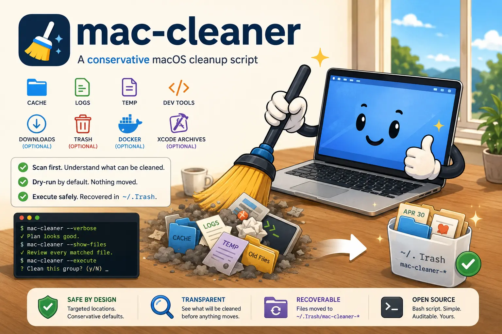

# mac-cleaner：安全、先审查的 macOS 清理工具



`mac-cleaner` 是一个保守的 macOS 清理命令行工具，适合希望在删除任何内容之前先看到清理计划的用户。

它会扫描旧缓存、日志、临时文件、开发者缓存，以及需要显式开启的清理区域，例如 Downloads、Trash、Docker 和 Xcode archives。

默认行为是安全的：它只扫描、打印审查计划，并写入一个已注释的清理脚本。执行模式不会永久删除文件；你批准的项目会被移动到 `~/.Trash` 下带时间戳的恢复目录。

## 安装

安装最新的 GitHub Release：

```bash
curl -L https://github.com/cuicaihao/cleanmymac-shell/releases/latest/download/mac-cleaner.tar.gz -o mac-cleaner.tar.gz
tar -xzf mac-cleaner.tar.gz
chmod +x mac-cleaner
mkdir -p "$HOME/.local/bin"
mv mac-cleaner "$HOME/.local/bin/mac-cleaner"
```

或者从源码 checkout 安装：

```bash
make install PREFIX="$HOME/.local"
```

请确保 `$HOME/.local/bin` 已在你的 `PATH` 中。

## 快速开始

始终先从 dry run 开始：

```bash
mac-cleaner --verbose
```

Dry-run 模式会：

- 按风险和类别打印清理计划。
- 显示可以清理多少项目、释放多少空间。
- 写入一个已注释的 `clean.sh` 审查脚本。

如需逐个文件完整审查：

```bash
mac-cleaner --show-files
```

如需引导式流程：

```bash
mac-cleaner --interactive
```

当清理计划看起来安全时：

```bash
mac-cleaner --execute
```

执行模式会再次显示每个分组，询问 `y/N/q`，默认是 No。批准的文件会被移动到 `~/.Trash/mac-cleaner-*`，不会被永久删除。

## 常用选项

```bash
mac-cleaner --verbose
mac-cleaner --show-files
mac-cleaner --interactive
mac-cleaner --dry-run --older-than 30 --include-downloads --verbose
mac-cleaner --clean-log
mac-cleaner --execute --empty-trash
mac-cleaner --execute --include-docker
mac-cleaner --execute --include-xcode-archives
```

## 它会清理什么

- 旧的用户缓存内容，包括常见浏览器和编辑器缓存。
- `~/Library/Logs` 中的旧文件。
- 旧的崩溃报告。
- 当前 macOS 临时目录中的旧临时文件。
- 开发者缓存，例如 Xcode DerivedData、Homebrew、npm、pip、Cargo、Gradle 和模拟器缓存。
- 可选的 `~/Downloads` 旧文件。
- 可选的 `~/.Trash` 内容。
- 可选的 Docker builder 和 system prune。
- 可选的旧 Xcode Organizer archives。

## 审查脚本

Dry-run 模式会写入一个带注释命令的审查脚本：

```bash
# == User cache contents older than threshold [low risk] ==
# Size: 4.0 KB
# rm -rf -- /Users/you/Library/Caches/example
```

在你手动编辑之前，这个文件里的内容不会执行。内置的 `--execute` 模式比运行生成的脚本更安全，因为它会先把文件移动到 Trash。

## 配置

你可以在 `~/.config/mac-cleaner/config` 中保存常用选项。也支持旧路径 `~/.mac-cleaner.rc`。

配置按以下顺序生效：

```text
内置默认值 < 配置文件 < 命令行参数
```

可以从示例配置开始：

```bash
mkdir -p ~/.config/mac-cleaner
cp examples/mac-cleaner.config.example ~/.config/mac-cleaner/config
```

示例配置：

```bash
# 使用 1 启用选项，使用 0 禁用选项。
OLDER_THAN_DAYS=30
VERBOSE=1
SHOW_FILES=0

INCLUDE_DOWNLOADS=0
INCLUDE_DOCKER=0
INCLUDE_XCODE_ARCHIVES=0
EMPTY_TRASH=0
```

配置文件会作为 shell 片段加载。不要粘贴或使用来自不可信来源的配置文件。

## 日志

脚本会在 `${XDG_STATE_HOME:-$HOME/.local/state}/mac-cleaner/mac-cleaner.log` 维护持久日志。

持久日志会注意隐私：终端输出会显示准确的本地路径供你审查，但保存到日志中的路径细节会被省略。

如需在不运行清理扫描的情况下清空日志：

```bash
mac-cleaner --clean-log
```

## 安全说明

- 脚本不会扫描受保护的系统目录。
- 脚本不需要管理员权限。
- `~/Downloads`、`~/.Trash`、Docker 清理和 Xcode Organizer archives 都需要显式开启。
- 执行模式会先把文件移动到 `~/.Trash/mac-cleaner-*`，而不是永久删除。
- 执行模式在移动每个分组前都需要输入 `y`；默认是 No。输入 `q` 可以停止审查剩余分组。
- `--yes` 可以在可信自动化中跳过低/中风险提示。高风险分组仍然会询问。
- Docker 清理是独立且永久的。在交互式执行模式中，它需要输入 `PRUNE`。
- 使用 `--include-downloads`、`--empty-trash`、`--include-docker` 和 `--include-xcode-archives` 时要格外小心。
- Xcode Organizer archives 可能包含发布构建、dSYM 和提交历史。开启前请先审查 dry-run 输出。
- 始终先运行 dry run，并在使用 `--execute` 前阅读输出。

## 开发

检查、版本管理和发布步骤请参见 [CONTRIBUTING.md](CONTRIBUTING.md)。

## 许可证

MIT License。参见 [LICENSE](LICENSE)。
